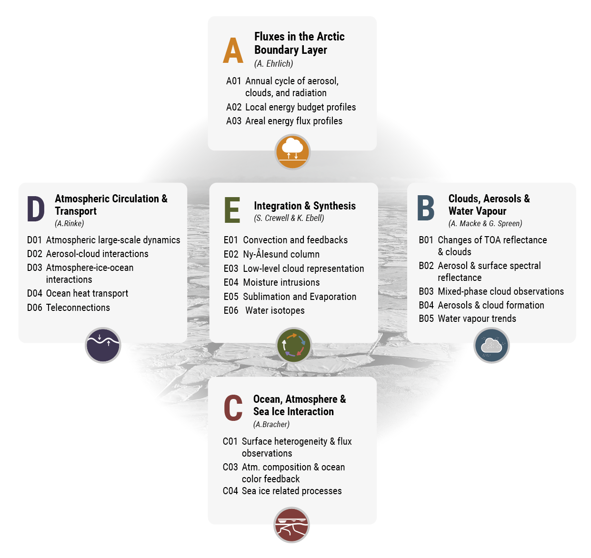

For more information visit the official project website: https://ac3-tr.de.

(AC)³ addresses five major scientific focus areas represented by five project Clusters A – E.

::::{grid} 5
:::{embed} #clustera
:::
:::{embed} #clusterb
:::
::::

[Website of the (AC)³ project](https://www.ac3-tr.de/)

## Scientific background

Planet earth has warmed on average by 0.87 K over the past 150 years. 
In the Arctic, the warming is much larger, which became most prominent over the last decades.
Currently, the Arctic warming exceeds the increase of near-surface air temperature in the mid-latitudes by about 2 K.
This phenomenon is commonly referred to as **Arctic amplification**.

:::{figure} ./figures/aa_plot_web-1024x517.jpg

Time series of zonally and meridionally averaged, near-surface air temperature differences (anomalies). (a) shows the annually averaged differences of the near-surface air temperature relative to the corresponding long-term mean over the time period of 1951-1980 for the Arctic (60°-90° N), midlatitudes (30°-60° N), Tropics (20°S-20°N), and the globe. The solid line show the slope used to calculate the Arctic amplification factors. (b) illustrates the difference of the warming in the Arctic shown in (a), and the global average warming for winter (DJF) and summer (JJA). The thick lines in (a) and (b) without symbols indicate five-year running averages. The data are provided by the NASA GISTEMP Team, 2020: GISS Surface Temperature Analysis (GISTEMP), version4. NASA Goddard Institute for Space Studies. Date set accessed at https://data.giss.nasa.gov/gistemp/ on 16 March 2023. Figur has been updated from [Wendisch et al. (2023)](https://doi.org/10.1175/BAMS-D-21-0218.1).
:::

The excessive Arctic warming, which is predicted to progress during the 21st century, is both a consequence and a driver of feedback processes specific to the Arctic. These interlinked mechanisms cause further dramatic and alarming changes, such as the stronger-than-expected decline of the Arctic sea ice observed since about 1970. The feedback processes are related in part to the unique Arctic conditions such as the pronounced temperature inversions close to the ground, heterogeneous surface conditions (open ocean, sea ice), and persisting low-level clouds (often mixed–phase). Additional feedback processes result from atmospheric and oceanic transport and exchange of heat, humidity, and momentum between the ocean currents and the tropospheric and stratospheric circulation. In addition to physical feedback processes, biogeochemical mechanisms involving atmospheric chemistry and the oceanic biosphere impact on the oxidising capacity of the atmospheric boundary layer and free troposphere, as well as on algae and phytoplankton production in the oceanic surface layers. The changes of the atmospheric and oceanic composition affect their energy budget. Although several of the individual feedback pathways are qualitatively identified, their combined influence and relative importance for Arctic amplification are complicated to quantify and difficult to disentangle. As a result, there is currently no consensus about the magnitude of individual atmospheric and oceanic feedback mechanisms for Arctic amplification. On the contrary, there are diverging interpretations on how Arctic amplification interacts with mid-latitude weather phenomena.

:::{figure} ./figures/grafic_scheme_aa_final_antrag-1024x655.png

The simplified (AC)³ schematic of important local and remote processes and feedback mechanisms driving Arctic amplification. The figure illustrates the initial triggering by Global Warming (red), and shows examples of process/feedback mechanisms such as the local Surface Albedo Feedback (black), Upper Ocean Effects (brown), local Atmospheric Processes (green), and remote Arctic - Midlatitude Linkages (yellow). Adapted from [Wendisch et al. (2023)](https://doi.org/10.1175/BAMS-D-21-0218.1).
:::

During phase I, **significant progress** has been achieved in several geophysical areas. Firstly, we have substantially **advanced our knowledge on key atmospheric processes**, in particular with regard to Arctic mixed-phase clouds, and their interaction with surface parameters. This improved understanding is based on comprehensive measurements obtained from elaborated field campaigns and long-term ground-based and satellite observations, in concert with respective simulations. Secondly, the foundations for a unique **long-term assessment of Arctic  climate changes using satellite climate data** records have been established, which will overcome the inherent limitations of reanalysis. New satellite retrieval techniques have been developed to generate long term data sets required to identify accurately changes in key oceanic and atmospheric parameters and constituents from local to regional scales. Thirdly, we have **enhanced the representation of feedback mechanisms in atmospheric process and climate models**. As a particular highlight, we have implemented new parameterisations (e.g., surface albedo) derived from our campaigns into regional model schemes, which notably improved the model performance.

The **overarching goals** for phase II are to **identify, investigate, and evaluate the key processes contributing to Arctic amplification**, to improve the understanding of the local and remote feedback mechanisms, and to quantify their relative importance for Arctic amplification. Four crosscutting activities (CCAs) will be implemented to qualitatively elevate our research to a new, highly integrative level. Within the CCAs we will pursue the effective concept of combining campaign observations and longer term measurements (ground-based, ship, airborne, satellite) with regional process and global climate modelling. Specifically, we will investigate the full annual cycle of Arctic climate changes, and the scarcely observed central Arctic. Furthermore, we will cover larger spatial scales with a particular emphasis on process studies, such as warm air intrusions into the Arctic or cold air outbreaks, as important examples of Arctic mid–latitude linkages. We will expand the assessment of the oceanic and sea ice compartments and their links to the atmosphere. As an important collaborative effort, we are involved decisively in two major observational campaigns. To obtain data over the entire annual cycle from the central Arctic, we have already initiated research to make unique German university based contributions to the international Multidisciplinary drifting Observatory for the Study of Arctic Climate ([MOSAiC](./campaigns/mosaic.md)) expedition. To investigate warm air intrusions into the Arctic and cold air outbreaks, we propose to apply the High Altitude and Long Range Research Aircraft ([HALO](./platforms/halo.md)). These two field studies will cover much extended spatial and temporal scales than those observed in phase I. They will be analysed in collaboration with modelling activities building mostly on the unique Icosahedral non–hydrostatic (ICON) model family.

We will use a hierarchy of ICON configurations that covers a broad range of scales, including micro-, meso-, regional, and up to global scales. This allows to gain insight into Arctic amplification at multiple levels, from individual processes to global responses. The models will serve to guide the campaigns, to interpret the measurements and sensitivities, to facilitate the attribution of the origins of observed Arctic climate changes, and to evaluate the ability of the models to reproduce the observations. In parallel, the satellite studies will provide local to regional scale observations of the Arctic. This will deliver data for comparison with the higher (but sparse) spatial resolution of the aircraft measurements. Building on these comprehensive efforts, realistic projections of the future Arctic climate will be developed as a main topic in phase III.

In order to achieve fundamental and significant advances in our understanding of Arctic Amplification we will continue to pursue the following three Strategic Questions (SQs):

- **SQ1: What are the main causes of, and their relative contributions to, Arctic amplification?**
- **SQ2: How do changes in meridional transports impact Arctic and midlatitude weather and climate?**
- **SQ3: What trends caused by Arctic amplification can be identified and how they will evolve in a future, warmer climate?**
