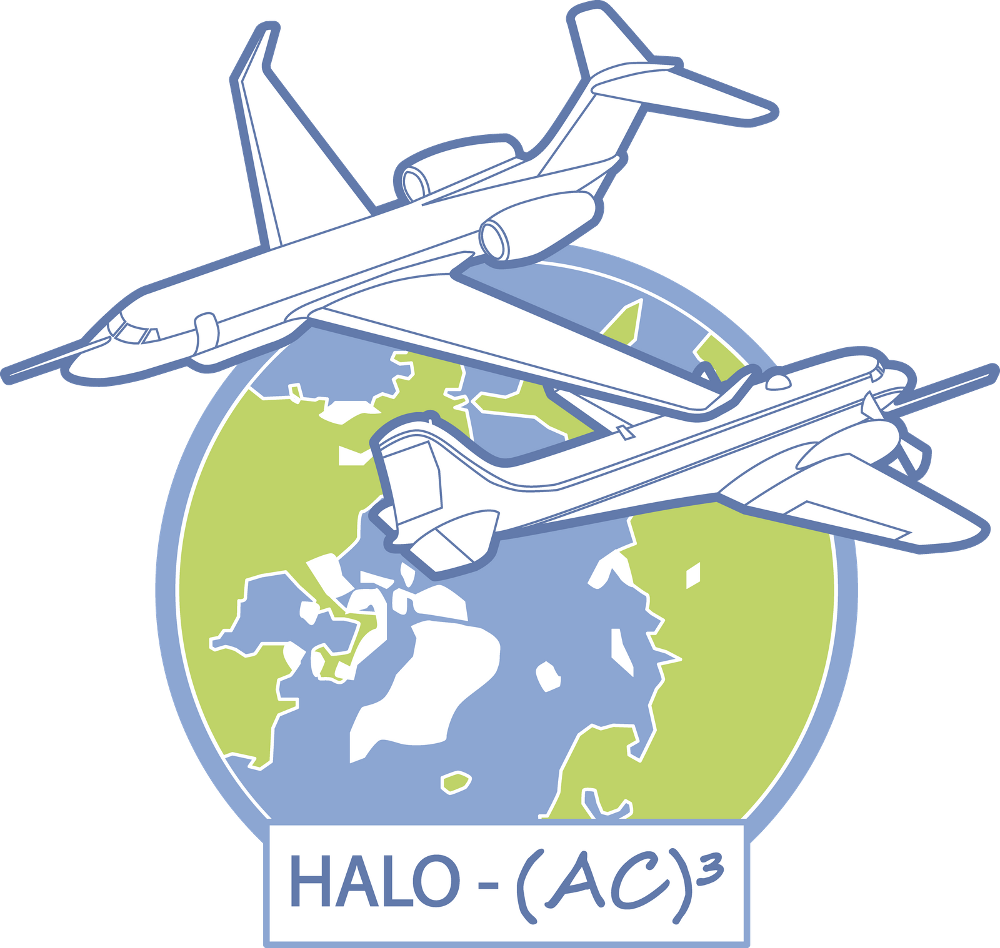
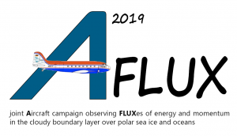
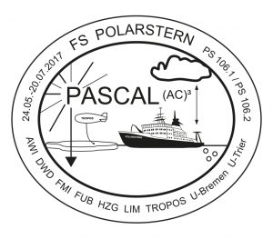

# Campaigns

The (AC)³ project organized and took part in many measurement campaigns.

::::{grid} 3

(haloac3-card)=
:::{card} 
:header: **HALO-(AC){sup}`3`**
:link: /haloac3

 
:::

(mosaic-card)=
:::{card}
:header: **MOSAiC**
:link: /mosaic

:::

(aflux-card)=
:::{card}
:header: **AFLUX**
:link: /aflux

:::

::::

::::{grid} 3

(acloud-card)=
:::{card}
:header: **ACLOUD**
:link: /acloud

:::

(pascal-card)=
:::{card}
:header: **PASCAL**
:link: /pascal

:::

::::