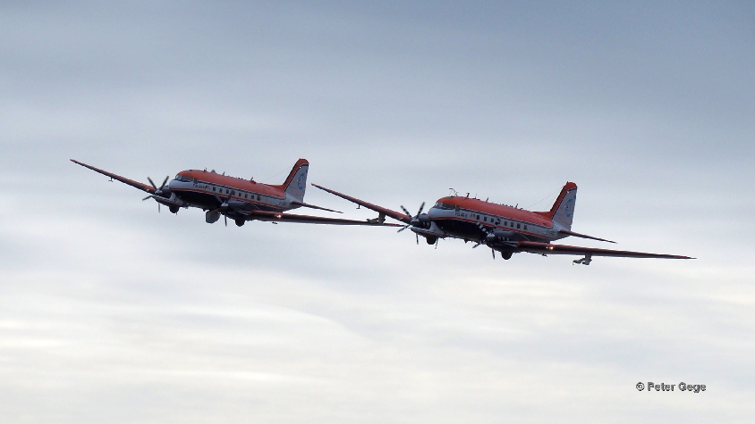

# Measurement Platforms
The (AC)³ project utilizes multiple measurement platforms.

## Airborne

::::{grid} 3

:::{card} 
:header: **HALO**
:link: /halo

 
:::

:::{card}
:header: **Polar 5**
:link: /polar5

:::

:::{card}
:header: **Polar 6**
:link: /polar6

:::

::::

## Ground Based

::::{grid} 3

:::{card} 
:header: **Title**
:link:

 
:::

::::

## Spaceborne

::::{grid} 3

:::{card} 
:header: **Title**
:link:

 
:::

::::

## Shipborne

::::{grid} 3

:::{card} 
:header: **Title**
:link:

 
:::

::::