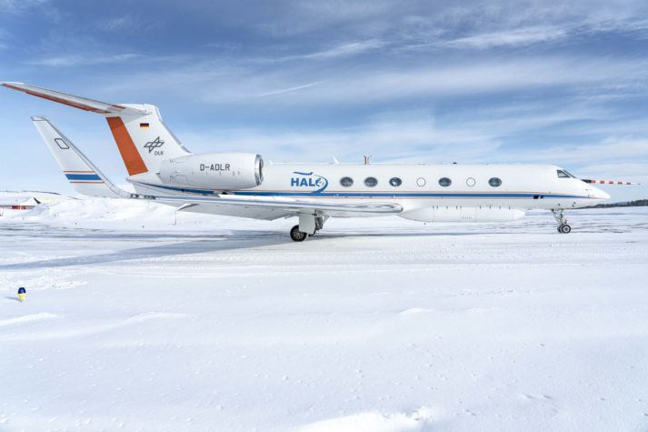

# Measurement Platforms
The (AC)³ project utilizes multiple measurement platforms.

## Airborne

::::{grid} 3

:::{card} 
:header: **HALO**
:link: /halo
:footer: Photo: Daniel Beckmann, DLR (CC BY-NC-ND 3.0)

 
:::

:::{card}
:header: **Polar 5**
:link: /polar5

[//]: # (![Polar5]&#40;./figures/home_planes_small.png&#41;)

:::

:::{card}
:header: **Polar 6**
:link: /polar6

[//]: # (![Polar6]&#40;./figures/home_planes_small.png&#41;)

:::

::::

## Ground Based

::::{grid} 3

:::{card} 
:header: **Title**
:link:

 
:::

::::

## Spaceborne

::::{grid} 3

:::{card} 
:header: **Title**
:link:

 
:::

::::

## Shipborne

::::{grid} 3

:::{card} 
:header: **RV Polarstern**
:link: /polarstern

 
:::

::::