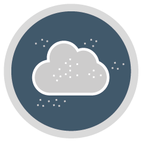

---
authors:
  - Gunnar Spreen
  - Andreas Macke
---
# Cluster B - Clouds, Aerosols & Water Vapour	

(clusterb)=

## Topic

Investigate the marco- and microphysical properties of Arctic clouds, aerosols and water vapour, together with their energetic forcing

## Key question

Which long-term trends of clouds, aerosol, and water vapour occurred in the Arctic over the last 30 years? Are remote Arctic amplification effects due to clouds, aerosol particles, and water vapour, as observed along air mass transports into and out of the Arctic, larger than the corresponding local effects in their seasonal variability? Are these cloud, aerosol, and water vapour effects more important than local effects by leads or polynyas and sea ice? Can we capture variability well enough?

## Tools

Ground-based, aircraft, satellites remote sensing, in-situ techniques, modelling

# Projects

::::{grid} 8
(b01)=

(b02)=

(b03)=

(b04)=

(b05)=

(b06)=

(b07)=

(b08)=

::::
