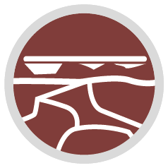
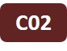
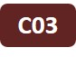
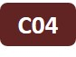

# Cluster C - Ocean, Atmosphere & Sea Ice Interactions

(clusterc)=

## Topic:
Quantify the surface spectral reflectance, the impact of natural/anthropogenic constituents and the changing phytoplankton functional types, oceanic processes
                
## Key question:
How strong is the impact of changing surface properties (sea ice types and extent, snow, ocean extent and the oceanic mixed layer, melt ponds) and their horizontal heterogeneity, on (a) the boundary layer trace gas composition, the types and amount of phytoplankton types, and (b) the vertical energy fluxes from across the pycnocline through the ocean/sea ice interface and through the lower ABL?

## Tools:
Ground-based, aircraft, satellites remote sensing, modeling

## **Projects**

::::{grid} 6
(c01)=

(c02)=

(c03)=

(c04)=

::::
