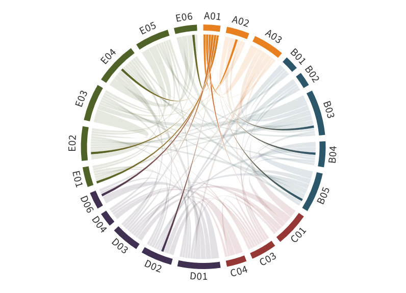

---
authors:
  - Andreas Macke
  - Roel Neggers
title: A01
---
# Aerosol, clouds, and radiation characteristics from observations and Big Data analysis

(a01)=

The combination of ground–based remote sensing and radiation measurements, as well as modeling for the PASCAL and MOSAiC expeditions enabled us, for the first time, to resolve the causal relationships between the state of the atmosphere, the properties of aerosol and clouds, and the forcing at the sea ice surface in the Central Arctic during a full annual cycle. In addition to the initial project goals we identified the persistent presence of forest fire smoke in the upper troposphere and lower stratosphere during large parts of MOSAiC. Through case studies, we have described the relationship between the microphysical structure of clouds and the cloud-relevant properties of Arctic aerosol particles. Statistics of the frequency of ice formation in Arctic supercooled clouds revealed that clouds that are coupled to the planetary boundary layer form ice more frequently than free-tropospheric clouds do at similar temperatures. We demonstrated that undetected low-level clouds caused significant errors in the surface radiation closure between simulations using ground-based remote sensing of aerosol and clouds and irradiance (flux densities, hereafter called fluxes) measurements at the ground, and improved the cloud detection accordingly. Ultimately, we obtained unique, continuous time series of Large-Eddy Simulation (LES) runs and height-resolved Cloudnet-based cloud macro- and microphysical properties for the whole MOSAiC period.

For phase III it is planned to bring the aerosol and cloud radiative studies into a larger context, by utilizing the extensive observational and modeling data sets by means of big data approaches. At the foundation of our method is the extensive combined model-observational data set, that will be applied to big data and to regime-based analyses. Radiative closure between observation- and LES-based radiative transfer simulations and surface radiation measurements will quantify uncertainties in our understanding of the Arctic radiation budget. Finally, year-long LES representing both present-day and perturbed MOSAiC climate are subjected to unsupervised and supervised learning and clustering analyses to identify and quantify emergent constraints, guided by climate model data.

## Hypothesis:

**Machine learning algorithms and radiative closure help to quantify physical and dynamical emergent constraints affecting Arctic amplification.**

Specific research questions in addressing this scientific hypothesis are:

- What are the contributions of major atmospheric regimes to Arctic aerosol and cloud properties observed during MOSAiC?
- Can we retrieve the conditions of the atmospheric column accurately enough to achieve a radiative closure for the whole MOSAiC drift experiment?
- Do the combined high-resolution data sets contain hidden information on fast-acting feedback mechanisms that function as emergent constraints on Arctic amplification?

A regime-based characterization of aerosol-cloud-radiation relations directly addresses the role of aerosols and clouds in the current and (by means of regime shifts) future Arctic surface radiative forcing (SQ1). Connecting the regimes to long-range transports of aerosols and humidity meets SQ2. Finally, SQ3 is addressed by identifying emergent constraints.

## Achievements phase II

- Surface-coupling effects on Arctic clouds were found to increase the occurrence of heterogeneously formed ice at low sub-zero temperatures
- Development of a robust model workflow for the accurate Large-Eddy Simulation (LES) of Arctic mixed-phase clouds based on observations-based calibration
- Generation of drift-long MOSAiC datasets of both daily LES and the time-height-resolved Cloudnet product of cloud microphysical properties, based on RV Polarstern observations

## Achievements phase I

A01 collected remote sensing measurements of vertical profiles of aerosol and cloud properties under different meteorological conditions during [PASCAL](../campaigns/pascal.md) ([Knudsen et al., 2018a](doi:10.5194/acp-18-17995-2018); [Wendisch et al., 2019](doi:10.1175/BAMS-D-18-0072.1); [Radenz et al., 2019](doi:10.5194/amt-12-4813-2019)). From the data, the aerosol and cloud radiative forcing at the surface was derived ([Barrientos Velasco et al., 2019](https://doi.org/10.5194/amt-13-1757-2020)). A distinct difference in the temperature for ice formation between clouds coupled to and decoupled from the surface was discovered. From the simulations, constrained by the observations, new insights into local and remote controls of clouds and radiation in the Arctic were obtained ([Neggers et al., 2019](doi:10.1029/2019MS001671)). The experience made during the observations helped to refine and further develop the techniques, which will allow improved microphysical characterisations of mixed–phase cloud layers during phase II.

## Role within (AC)³

