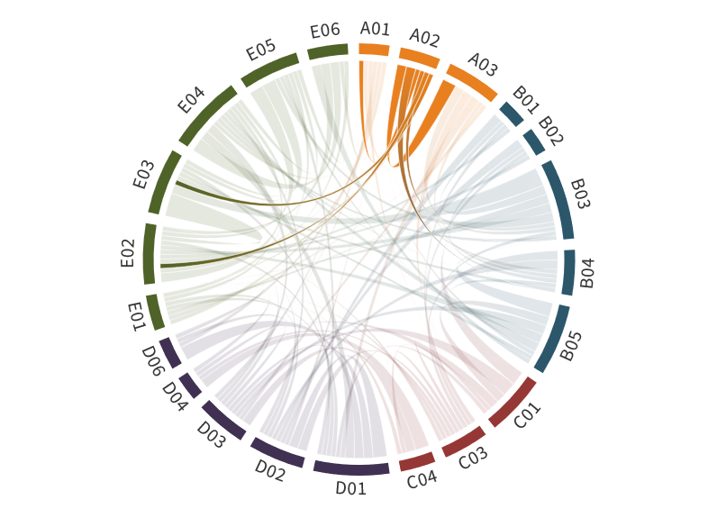

---
authors:
  - Holger Siebert
  - Manfred Wendisch
title: A02
---
# Balloon-borne observations and dedicated simulations of the transitions between typical states of the Arctic atmospheric boundary layer 

(a02)=

This project builds on the successful balloon-borne measurements in phases I and II of (AC)³. As a major achievement, we have compiled a comprehensive set of data consisting of combined thermodynamic, turbulence, radiation, and aerosol/cloud properties. The data were collected in cloudless and cloudy conditions over Arctic sea ice and snow-covered land surface. They were assembled with partly newly developed instruments carried by tethered balloons during several campaigns. As a first step, the measurements enabled to derive more accurate surface layer mixing (SML) heights during polar night. Furthermore, important conclusions were drawn about the effects of entrainment of humid air at the top of clouds, the suppression of turbulence generated by cloud top radiative cooling in the lower cloud of a multi-layer cloud system, and the footprints of air mass characteristics in measured thermodynamic and aerosol/cloud profiles. First case studies observing the transition processes (cloud  formation and decay, low-level jet (LLJ) formation) and comparative studies between polar night and day were conducted. However, the complexity of the balloon  operations limited the continuity of profiling, which partially prevented an in-depth evaluation of the observed transition processes. Furthermore, it became increasingly obvious that the interpretation of the measurements would benefit greatly from an own additional modeling component.

Therefore, we propose to use smaller balloons with more compact payloads in phase III to increase flexibility and enable profile measurements over extended periods with a 5-minutes interval between the profiles.  This will facilitate to study the important transitions between typical states of the Arctic atmospheric boundary layer (ABL) in, so far, unprecedented temporal resolution.  To obtain the required measurements, we suggest a four-week campaign in North-East Greenland (Villum Station, Station Nord). In addition, we propose to apply a  sophisticated large eddy simulation (LES) model and a single-column model (SCM) to quantify the ability of the models to adequately represent the transition processes,  to identify corresponding weaknesses, and to perform dedicated process studies. The LES fully resolves the dynamical boundary layer processes on larger scales, but is  more complex to operate and computationally expensive. The SCM is less complicated to run, it is fast, and can be used for inexpensive parameterization testing and  sensitivity studies. Furthermore, we plan to include ICON simulations in weather forecast mode in coarser temporal resolution. These ICON runs will cover the entire  measurement period of the proposed campaign in Greenland and will be used to assess the transition from polar night to polar day. Finally, the measurement and  modeling efforts proposed in this project will be applied to quantify the impact of changes of the ABL structure and height during the three state transitions investigated  in our project on the surface warming via the lapse rate feedback.

## Hypothesis:

**Highly resolved profile data of the Arctic ABL are needed to realistically simulate typical ABL transition processes and to investigate their effects on the lapse rate feedback.**

## Specific questions:

- How do measured profiles of thermodynamic, turbulence, radiative, and aerosol properties evolve during the transition from cloudless to cloudy conditions and  during the formation of LLJs, and how well can these non-steady transformations be modeled by LES and SCMs?
- How well does ICON in weather forecast mode represent the transition period from polar night to day, and can possible model deficiencies in this regard be  resolved?
- How do stability, temperature lapse rate, inversion height/strength, vertical humidity and cloud distributions influence the surface warming and the lapse rate feedback in cloudless and cloudy situations?

Arctic amplification appears most pronounced in winter, when particularly distinct near-surface air temperature and humidity inversions, and related shallow ABLs  develop. With the profile measurements and simulations proposed in this project we will investigate how these ABL specifics and their changes during typical  transformation processes influence the lapse rate feedback as one of the major drivers of Arctic amplification. Thus, we will contribute to the understanding and  quantification of the lapse rate feedback for near-surface warming in winter. In this way, the project will contribute to answer SQ1.

## Achievements phase II

- Generation of a comprehensive data set of thermodynamic, turbulence, radiation, and aerosol/cloud parameter profiles , with a significant portion collected during polar  night ([Lonardi et al., 2022](https://doi.org/10.1525/elementa.2021.000120); [Akansu et al., 2023a](https://doi.org/10.5194/acp-23-15473-2023)),
- More accurate estimation of SML heights during the polar night from vertically resolved direct turbulence observations ([Akansu et al., 2023a](https://doi.org/10.5194/acp-23-15473-2023)),
- Verification of the effects of entrainment of humid air at the top of clouds on their lifetime ([Egerer et al., 2021](https://doi.org/10.5194/acp-21-6347-2021); [Neggers et al., 2019](doi:10.1029/2019MS001671))
- Approval of the effect of suppression of turbulence (generated by cloud top radiative cooling) in the lower cloud of a multi-layer cloud system due to shadowing effects ([Lonardi et al., 2022](https://doi.org/10.1525/elementa.2021.000120))
- Detection of signatures of air mass characteristics imprinted in the measured profiles of aerosol, radiation, and meteorological parameters ([Pilz et al., 2023](https://doi.org/10.1038/s41597-023-02423-5))
- Development of a new method for estimating turbulent fluxes ([Egerer et al., 2023a](https://doi.org/10.5194/amt-16-2297-2023))
- Investigation of the potential role of a LLJ for long-range transport ([Egerer et al., 2023b](https://doi.org/10.5194/acp-23-15365-2023)).

## Achievements phase I

A02 developed a novel instrumental payload carried by a tethered balloon. The Balloon-bornE moduLar Utility for proilinG the lower Atmosphere (BELUGA) system was applied on the sea ice camp during [PASCAL](../campaigns/pascal.md) ([Knudsen et al., 2018b](doi:10.5194/acp-18-17995-2018); [Wendisch et al., 2019](doi:10.1175/BAMS-D-18-0072.1); [Egerer et al., 2019](doi:10.5194/amt-12-4019-2019)). Humidity inversions just above cloud top have been discovered by the balloon measurements and verified by LES results ([Neggers et al., 2019](doi:10.1029/2019MS001671)). With these data, the entrainment of moisture into the cloud was investigated. Furthermore, it was shown that cloud top cooling efficiently drives turbulence. In case of multi-layer clouds, the cloud top cooling of the lower cloud is significantly suppressed.

 
## Role within (AC)³

