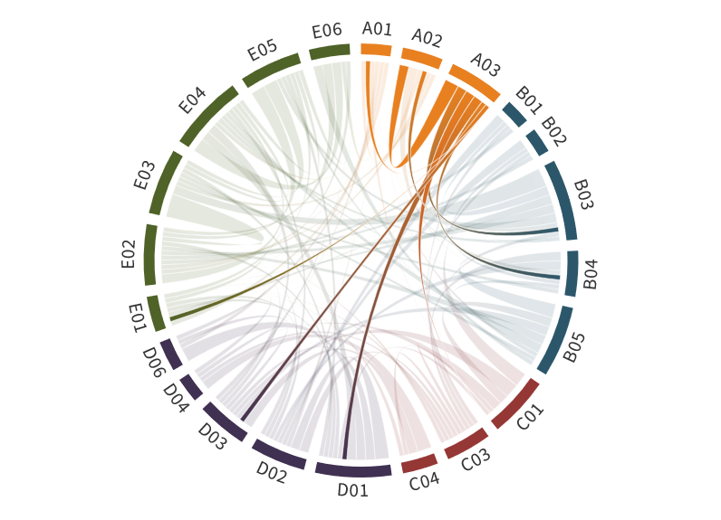

---
authors:
  - Dörthe Handorf
  - Andreas Herber
  - Michael Schäfer 
  - (former PIs Christof Lüpkes, Manfred Wendisch)
title: A03
---

# Impact of low-level clouds and surface conditions on Arctic atmospheric boundary layer turbulence and radiation 

(a03)=

A detailed understanding of Arctic amplification requires to study cloud processes in the Arctic atmospheric boundary layer (ABL). A03 concentrates on the complex interplay between radiative and turbulent processes and how they are influenced by low-level clouds and surface characteristics. Three topics were on the agenda during  phases I and II: The first topic investigated the warming or cooling effect of the near-surface air by clouds (cloud radiative effect, CRE). Based on the observations of five seasonally different airborne campaigns it was found that the terrestrial CRE is a strong function of cloud and thermodynamic properties of the ABL. However, it showed  weak differences between the seasons and surface types. We concluded that the solar CRE drives the variability of the total CRE with a cooling effect of clouds over open  ocean and a mostly warming impact over sea ice, which vanishes for low solar zenith angles (SZA). The second topic aimed at a better understanding of the cloud impact on Arctic ABL processes. Results showed that, independent on season, clouds strongly affect the ABL due to their interaction with radiation and turbulence. In the third  topic, new parameterizations of turbulent transport in stable stratification were developed, for easy implementation in climate models.

The airborne (AC)³ data sets as well as the new parameterizations provide huge potential for further research. Therefore, more detailed data analyses are planned in phase III, focusing on the evolution of the CRE in air mass transformation processes and extensions of the analysis from single- to multilayer cloud cases. A special focus will also be on the impact of surface inhomomgeneity on ABL processes and their interplay with cloud-related processes. However, the previous (AC)³ aircraft data were limited to the height of 60 m  because of safety rules. Therefore, in phase III, we will use the newly developed towed aircraft sonde T-Bird for turbulence measurements. With measurements at altitudes of 15-20 m above the surface, shallow internal boundary layers can be reached. As a result, height corrections of drag coefficients to the usual reference height of 10 m will have only a minor impact as compared to corrections from previous campaign data. Together with results from a thermal-infrared imager that was introduced by  and operated during HALO–(AC)³ in March/April 2022, this will lead to improved parameterizations of near-surface processes. This will be done on the basis of parameterizations developed so far in A03 and in previous work by A03 scientists concerning surface roughness (Lüpkes et al., 2015). Finally, the parameterization concept developed in A03 allows efficient sensitivity tests in climate models. The impact of the parameterizations, e.g., in regional and global models, will be analyzed together with modeling projects. Vice versa, this will further improve the parameterizations. Furthermore, the data concerning the CRE allow us to  identify weaknesses of regional models concerning the cloud impact on radiation and turbulence by comparing model results with measurements.

## Hypothesis:

**Arctic atmospheric boundary layer clouds and near-surface processes significantly contribute to Arctic amplification.**

Specific questions which will be answered in the project are:

- How do the radiative fluxes evolve in air mass transformation processes?
- Can airborne near-surface turbulence measurements improve the parameterizations of turbulent fluxes?
- Do new parameterizations of air-ice-ocean interaction processes improve the representation of large scale meteorological variables in climate models?

The investigations contribute to the strategic question SQ1, by quantifying the warming or cooling effect of clouds on the Arctic surface in different conditions and the clouds’ impact on mixing processes influencing the lapse rate.

## Achievements phase II

- A seasonal and surface dependent quantification of the solar and terrestrial contributions to the CRE was performed.
- Analysis of fluxes in the ABL reveal large impact of multi-layer clouds and distinct differences to lower latitude marine stratocumulus clouds.
- New turbulence parameterizations for stable boundary layer and convection over leads were developed.
- Large Foehn impact was shown on snow melt in Svalbard and northern Fram Strait flow regimes.

## Achievements phase I

A03 has quantified the cooling/warming effects of clouds as a function of surface properties using low-level aircraft measurements during ACLOUD and AFLUX ([Stapf et al., 2019a](https://doi.org/10.5194/acp-20-9895-2020)). Measured radiation fields below clouds were compared with results of ICON simulations with 2.4 km resolution ([Wendisch et al., 2019](doi:10.1175/BAMS-D-18-0072.1)). It became apparent, that the measured surface albedo fields needed to be considered in the simulation to realistically represent the mode structure of the measured net radiation field by the ICON model. A large variability of the turbulent flux profiles inside the clouds depending on radiative cooling at cloud top was observed. A new parameterisation of the stability dependence of transfer coefficients for momentum, heat, and moisture was developed ([Gryanik & Lüpkes, 2017](doi:10.1007/s10546-017-0302-x)). Furthermore, the warming effect of leads was quantified as a function of wind speed ([Chechin et al., 2019](https://doi.org/10.1175/JAS-D-18-0277.1)). It was shown that leads might play a key role for the often observed development of decoupling between the sea ice surface temperature and the boundary layer temperature ([Chechin & Lüpkes, 2019](doi:10.1088/1755-1315/231/1/012011)).

 
## Role within (AC)³

