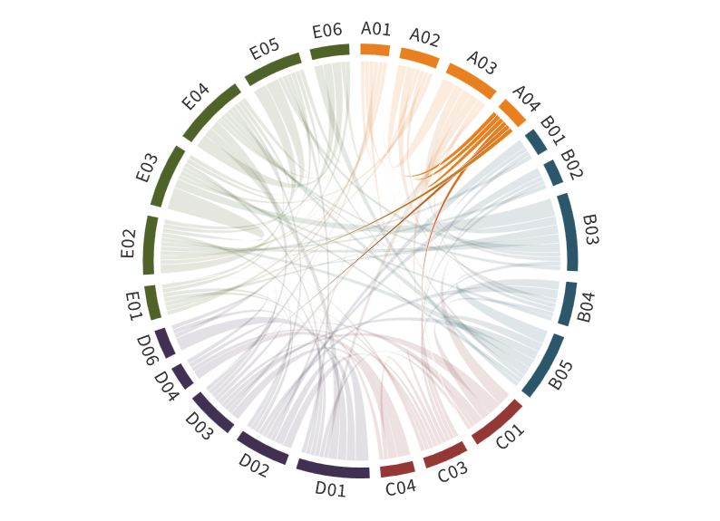

---
authors:
  - Nikki Vercauteren
title: A04
---
# Effective representation of surface-atmosphere fluxes above heterogeneous sea-ice cover for use in climate models 

(a04)=

Sea-ice cover exerts important controls on the Arctic climate and may form horizontally heterogeneous patterns, especially in the marginal ice zone (MIZ). Earth System Models (ESMs) represent the sea-ice heterogeneity within a grid cell as an ice fraction. The heterogeneous sea-ice cover, however, causes complex nonlinear surface-atmosphere interacting processes that cannot be quantified appropriately using solely the ice fraction. Among the nonlinear interacting processes are the secondary circulations in the atmospheric boundary layer (ABL) that are driven by the sea-ice and ocean water surfaces and their thermal contrast. An effective representation of the surface-atmosphere momentum, temperature and moisture exchanges for a grid cell of an ESM is required for cases where the sea-ice cover exhibits important variability within a grid cell. This representation should accommodate for the occurrence of secondary circulations.
This is of particular relevance when leads evolve in the sea ice. These elongated cracks in the sea-ice cover expose local regions of open ocean water with surface temperatures much higher than the surrounding sea ice. As a result, convective plumes develop above leads. Even if leads occupy a small areal fraction only, their impact on the regional temperature, atmospheric stability over sea ice, and surface-atmosphere fluxes in winter is disproportionally large.

The goal of this project is to derive quantitative parameterization of surface-atmosphere energy, temperature and moisture fluxes for use in coarse-resolution ESMs. The parameterization will accommodate the lack of representation of sea-ice variability below the size of the ESM grid, which is of the order 20-100 km in typical CMIP  experiments. Results of measurements and modeling studies obtained during the previous phases of (AC)³ quantified the importance of lead-generated fluxes and  showed that the spatial distribution of sea ice and open ocean water plays a key role in determining the ABL structure. Furthermore, in the previous phases of (AC)³, a parameterization of convection over leads was developed for use in microscale models. This project will upscale the efforts of (AC)³ activities to an effective  representation of surface-atmosphere exchanges via fluxes (momentum, temperature, moisture) above heterogeneous sea ice for use in larger-scale ESMs with grid sizes of the order of 20-100 km. These scales have not been covered adequately within (AC)³, and thus this projects perfectly fits into the general objective of (AC)³ in its third phase to project Arctic amplification on larger spatial scales. The observations of sea ice collected within (AC)³ will be leveraged to obtain surface characterisation metrics that condense the description of spatially inhomogeneous sea-ice patterns. The wealth of data collected during the [Multidisciplinary drifting Observatory for the Study of Arctic Climate (MOSAiC)](../campaigns/mosaic.md) drift experiment includes helicopter-borne thermal infrared imaging and satellite data of leads occurrence ranging from local (1 m) to regional  scales. The importance of those metrics to effectively represent the ABL above heterogeneous sea ice will be explored, using data from MOSAiC and from observation-enhanced large eddy simulations (LES) for the derivation and testing. The expected results will enable the representation of surface fluxes from partly sea-ice covered surfaces in ESMs.

In a warming Arctic with thinner sea ice, the number of leads is likely to increase. If this is the case, more atmospheric convection will be initiated  which would erode the strong temperature inversions common over sea ice, especially in the Arctic winter. These temperature inversions represent a key aspect of the lapse-rate feedback, as the strong temperature inversions inhibit vertical mixing and hence keep the heat that is released due to surface warming below the inversion. The resulting preferential warming close to the surface gives rise to a positive feedback as the radiative energy flux is absorbed and re-emitted close to the surface, which  enhances the effectivity of the surface warming. More accurate representation of surface-atmosphere fluxes over fractional sea-ice, as proposed in this project, are a  necessity to obtain accurate lapse-rate feedback analyses.

## Hypothesis:

**The transport of heat, momentum and moisture that results from secondary circulations in the presence of leads can be parameterised effectively using observation-based sea-ice heterogeneity parameters. The inclusion of secondary circulations will result in more accurate lapse-rate feedback analyses.**

In testing the hypothesis, we address the following overarching questions:

- What is the parameter set needed to effectively represent sea-ice spatial heterogeneity?
- Can the transport through secondary circulations be parameterised using observation-derived quantities and a dimensional analysis framework to scale the  competing effects of the sea-ice surface heterogeneity and meteorological forcing?
- What is the impact of sea-ice heterogeneity and secondary circulations on the lapse-rate feedback?

## Role within (AC)³

