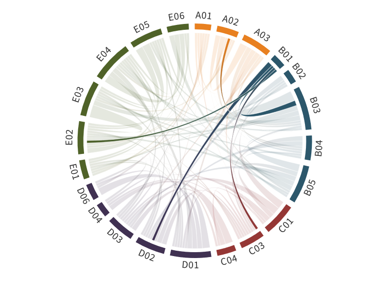

---
authors:
  - Marco Vountas (former PI:John P. Burrows)
title: B01
---
# Changes of the top–of–atmosphere reflectance, brightness temperatures, and cloud properties in the Arctic from 1995 to the present derived from satellite data 

(b01)=

The radiative balance of the Arctic depends on the absorption and scattering of solar radiation (shortwave, SW) and terrestrial radiation (longwave, LW) and their  resultant upward and downward SW and LW fluxes. Changes in the temperature, the amounts and distributions of water vapor, and the number and availability of Cloud Condensation Nuclei (CCN) and Ice Nucleating Particles (INP) lead to changes in the optical properties of clouds. This, in turn, leads to changes in the SW scattering and  LW absorption and emission of electromagnetic radiation by clouds. A better understanding of the fluxes of SW and LW radiation, the changing properties of clouds, the Earth’s surface, and the resulting SW reflectance and LW absorption and emission at the top and the bottom of the atmosphere is required to explain the processes determining Arctic amplification, and to test and thereby improve the accuracy of models and their projections of the Arctic climate. In phase II of the (AC)³ project B01,  we discovered that the pan-Arctic changes in the reflectance at the top-of-atmosphere, RTOA, retrieved from the measurements of satellite instruments, were significantly less than those expected from the changes due to the loss of Sea Ice Extent (SIE) between 1995 and 2018 ([Lelli et al., 2023](doi.org/10.5194/acp-23-2579-2023)). We  explain this behavior by a statistically significant increase in the cloud liquid water phase, and a related decrease in the cloud ice phase. As neither the total mass of  condensed water in the clouds, nor the cloud cover change significantly, we infer that observed net changes in the pan-Arctic reflectance RTOA result from decreases in  surface reflectance due to the loss of SIE and increases in cloud reflectance. The latter arises because liquid droplets scatter more effectively than ice crystals.

The Cloud Radiative Effect (CRE) is the difference between the net total (SW plus LW) radiative energy flux densities under all-sky and cloud-free conditions  ([Ramanathan et al., 1989](doi:10.1126/science.243.4887.57)). It plays a central role in quantifying radiative forcing during Arctic amplification. Our investigations of the regionally resolved CRE show that  changes in CRE are correlated with changes in the optical thickness of pure liquid clouds ([Lelli et al., 2023](doi:10.5194/acp-23-2579-2023)). Furthermore, our preliminary studies show that it is feasible  to retrieve information about mixed-phase clouds using satellite data. In phase III of (AC)³ , building on our research in phases I and II, our objectives are to understand  the evolution of Arctic amplification in the period 1995 to 2023 by studying RTOA, Brightness Temperatures at TOA (BTTOA) and the CRE. We plan to extend our  database of RTOA and use existing datasets for the BTTOA, e.g., the measurements of AATSR on Envisat (2002-2012) and SLSTR on Sentinel 3 (2016 – present). We shall analyze cloud reflectance changes and the corresponding terrestrial and solar fluxes using existing long-term datasets and then derive CRE estimates.

## Hypothesis:

**The increasing amount of liquid water clouds has significant and measurable effects on the radiative balance in the Arctic.**

To test this hypothesis and improve our understanding, we pose the following questions:

- Will the unexpectedly small, statistically insignificant negative trend of the pan-Arctic RTOA observed in the period 1995 to 2018, continue in the period from 2018 to 2023?
- What is the quantitative dependence of CRE on changes in selected cloud parameters?
- How is the ice volume fraction in mixed-phase clouds, retrieved from the RTOA measurements made by space-borne instruments, changing in the period from  2002 to 2023 in the pan-Arctic?

The scientific objectives of the project B01 contribute to the following Strategic Questions (SQ) of (AC)³: SQ1, which targets the causes of Arctic amplification. In B01 we  quantify and analyze the pan-Arctic spatial and temporal changes in RTOA, BTTOA, cloud properties, and CRE and thereby investigate the changes in radiative forcing,  which occur during the Arctic amplification. SQ3, which investigates the evolution of Arctic amplification. In B01 selected models used for this purpose in (AC)³ will be  evaluated by comparing the pan-Arctic changes in the modeled and measured values of RTOA, cloud properties, and CRE. The results will be used to improve our  knowledge of the accuracy of the model projections.

## Achievements phase I

B01 investigates changes in the Arctic climate system using the unique long-term satellite data record of top-of-atmosphere reflectance (RTOA) available from hyperspectral and multispectral spectrometers. Based on the compilation of a novel 24-year product merging different sensors a first analysis of the temporal evolution and trends of RTOA was carried out. Significant negative trends were found in some regions and seasons which are consistent with those of decreasing sea ice as expected. However, also positive trends could be identified. For attributing changes to cloud conditions identification algorithms and cloud retrievals were improved for Arctic conditions ([Mei et al., 2017a](doi:10.1016/j.rse.2016.11.015), [2018](doi:10.5194/acp-18-2511-2018), [2019](doi:10.1080/01431161.2019.1601279)).

## Role within (AC)³

Key characteristics of the satellite instruments relevant to (AC)³ and their role in the projects can be found [here](../files/06_supplement_satellitetable.pdf).
