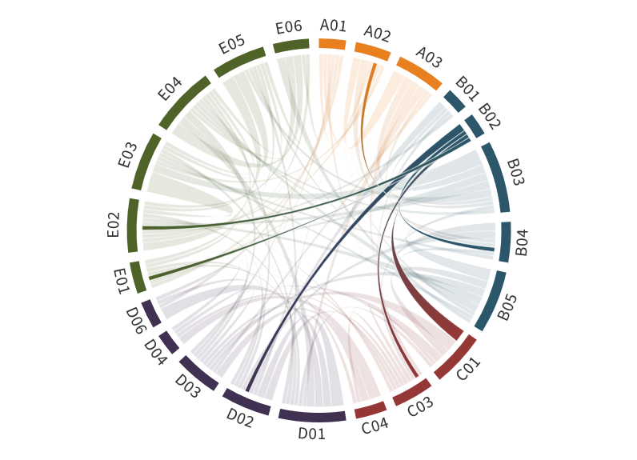

---
authors:
  - Hartmut Bösch
  - Marco Vountas (former PI:John P. Burrows)
title: B02
---
# Remote sensing of aerosols and their properties in the Arctic from satellite observations 

(b02)=

The quantification of the impacts of aerosols in the Arctic requires an understanding of the seasonally dependent long-range transport of pollution from lower latitudes, ice and snow melt, local aerosol sources, dry and wet deposition of aerosol particles, and aerosol-cloud interactions. However, the sign and magnitude of Arctic aerosol radiative forcing during the period of Arctic amplification is not adequately understood. For instance, global models have difficulties in simulating low-altitude Arctic mixed-phase clouds ([Pithan et al., 2016](https://doi.org/10.1002/2016MS000630)). Part of this difficulty is because the subsets of the aerosol population, which act as Cloud Condensation Nuclei (CCN) and Ice  Nucleating Particles (INP), are not sufficiently well represented. The number of ground-based measurements of AOT in the Arctic is small and the coverage is intrinsically sparse. Thus, improved knowledge of Arctic aerosols and their radiative effects is required to understand their changes and their impact on the Arctic climate during the  period of Arctic amplification. During the polar day, the retrieval of AOT from the measurements of passive remote sensing instrumentation on polar-orbiting satellites  provides potentially a high spatial resolution aerosol data product having broad coverage and high temporal sampling. The scientific objectives of this project address the  need to quantify the change in Aerosol Optical Thickness (AOT) ([Mei et al., 2020c](https://doi.org/10.1016/j.rse.2020.111731), [b](https://doi.org/10.1016/j.rse.2020.111731); [Vountas et al., 2020](https://doi.org/10.1016/j.jqsrt.2020.107311)), the aerosol types, and their composition during the period of  Arctic amplification.

In phase II of (AC)³, the importance of volcanic eruptions, which reach the stratosphere, on the stratospheric and total AOT, and their impact on the  AOT trends were identified. To resolve this issue for the period from 1981 to 2020 (i) the NOAA AVHRR total AOT dataset (merged with our own AOT retrievals over  water using the XBAER, eXtensible Bremen AErosol Retrieval algorithm applied to MERIS and OLCI data, for more details see below) was optimized by filtering clouds  and ice/snow over the ocean. We have observed small but statistically significant positive trends for this dataset; (ii) a new stratospheric AOT dataset was generated by  merging aerosol extinction, retrieved from passive remote sensing limb measurements and the active remote sensing measurements of CALIOP above the ocean in the  Arctic; (iii) a tropospheric AOT dataset was generated by subtracting the stratospheric AOT from the total AOT above the ocean in the Arctic. These spatially resolved and  temporally sampled datasets were analyzed and their changes and trends were investigated. In addition, a total AOT dataset was created over snow and ice-covered Arctic  surfaces from 2003 to 2012. The dataset was retrieved using the AEROSNOW retrieval algorithm developed at IUP. Significant differences between the AOT simulated by a chemical transport model (GEOS-Chem, e.g., ([Bey et al., 2001](https://doi.org/10.1029/2001JD000807))) and the AEROSNOW AOT retrievals were observed during episodes of biomass burning.  Active satellite remote sensing of aerosol by CALIOP was used to validate the passive satellite remote sensing AOT data products, used and retrieved in this study.

## Hypothesis:

**The regional trends of Aerosol Optical Thickness (AOT) in the Arctic are driven by changing emissions of aerosols and their precursors and by subarctic biomass burning  during the period of Arctic amplification.**

In phase III we will answer the following questions related to the hypothesis:

- How well are the observed changes in AOT, retrieved from satellite observations, reproduced by atmospheric models, and what are the reasons for the differences?
- Will the recently observed small positive trend in AOT above the ocean in the Arctic continue in the period 2020 to 2025 and which mechanisms drive this increase?
- How can the observed differences between modeled and observed AOT be explained during summer biomass burn episodes, and is there a significant correlation  between such episodes and phytoplankton dynamics in the Arctic?

Project B02 addresses key goals of (AC)³ by investigating the changes in AOT and corresponding radiation fluxes using satellite observations over the Arctic. It is one of  the (AC)³ projects, which investigates the behavior of AOT from the local to the pan-Arctic scale. The B02 research addresses two of the (AC)³ Strategic Questions (SQs).  It contributes to SQ1, which focuses on the causes of Arctic amplification, by determining the changes in total, stratospheric, and tropospheric AOT and assessing  their impact on Arctic amplification and vice versa; SQ3, which investigates the evolution of AOT during the Arctic amplification, by comparing the AOT in the Arctic,  retrieved from observations and climate models, which enabled the accuracy of AOT simulations and projections of climate models to be assessed.

## Achievements phase I

B02 exploits satellite data for detection of changes in Arctic aerosol. This is quite challenging and different approaches are needed from different surface types those spectral surface reflectance (SSR) is also of interest. Over the Arctic open waters a first long-term record of Aerosol Optical Thickness (AOT) covering a period of more than 35 years shows a significant increase of AOT over the Fram Strait during haze season, and over the Chuchki Sea during September. The record also indicate a significant increase of AOT over the northeast passage during July and September. Improved retrievals for dark to moderately bright surfaces, such as snow/ice-free land and ocean ([Jafariserajehlou et al., 2019](doi:10.5194/amt-12-1059-2019)) were developed. Progress has also been made in the field of AOT/SSR retrievals over bright surfaces (snow/ice covered areas) with a novel retrieval, which benefits from improved knowledge of aerosol typing and SSR treatment.

## Role within (AC)³

