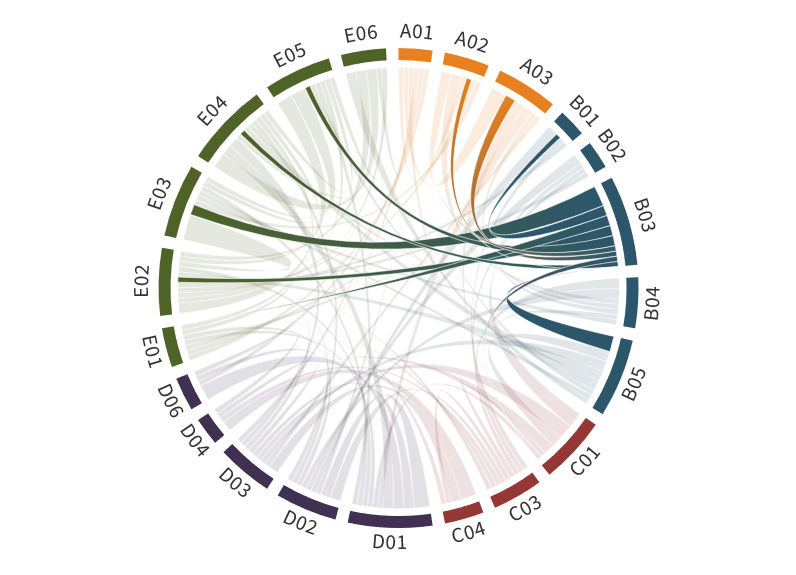

---
authors:
  - Susanne Crewell
  - Hartwig Deneke
  - André Ehrlich, (former PI:Andreas Macke)
title: B03
---
# Transformation of Arctic mixed–phase clouds in cold air outbreaks characterized by airborne and satellite remote sensing

(b03)=

The project aims at a thorough understanding of Arctic mixed-phase clouds and their role in Arctic amplification by synthesizing multi-campaign airborne observations obtained over the Arctic North Atlantic, complemented by a larger-scale satellite-based analysis. With novel instrumentation developed for the Polar 5 and 6 research aircraft in phase I, the [ACLOUD](../campaigns/acloud.md) and [AFLUX](../campaigns/aflux.md) campaigns were performed, followed by [MOSAiC-ACA](../campaigns/mosaic-aca.md) and [HALO–(AC)³](../campaigns/haloac3.md) in phase II. These measurements covered periods between March and September and provided important information for case study analysis and refined retrieval and product development. Initial statistical analyses of the cloud vertical column, microphysical properties, their radiative effects, and the interaction of aerosol and clouds for different seasons and surface conditions were started, and revealed general patterns, such as a higher cloud liquid water path and less cloud ice in summer compared to spring. Depending on the turbulent mixing in the atmospheric boundary layer, the presence of sea ice can influence the source of cloud forming particles (above or below cloud). Smaller cloud droplets were found in clouds over sea ice. However, other parameters, such as the cloud vertical distribution are more complex and seasonal or regional differences are mainly related to different air masses dominating the limited campaign periods.

The majority of the airborne measurements covered cold air outbreaks (CAOs), which especially are affected by air mass transformation. Cloud transformation processes in CAOs will, thus, be the focus of our analysis in phase III. To generalize our findings, we will extend the analysis by combining the comprehensive airborne record with Arctic-wide satellite observations. Modifications of cloud properties, such as cloud morphology, the distribution of ice and liquid cloud particles, the formation of precipitation, and the cloud radiative effects during air mass transformation will be investigated. Ultimately, we aim to quantify the climatological significance and patterns of CAOs for the Arctic using the satellite perspective. The [HALO–(AC)³](../campaigns/haloac3.md) observations by HALO and the Polar aircraft will serve as the main basis to study mixed-phase clouds and their development in CAOs in combination with satellite data and high resolution modeling. In particular, we will focus on two stages of cloud and air mass transformation: (i) The initial formation of clouds taking place over the sea ice due to leads, cracks, and over ice-free areas of the marginal sea ice zone (MIZ); and (ii) The downstream transition of cloud morphology, e.g., from roll convection into cell convection.

## Hypothesis:

**The cloud formation in the initial state of CAOs impacts the downstream evolution of cloud morphology, precipitation, and cloud radiative effects.**

For testing this hypothesis the work in phase III aims to answer the questions:

- How and when do transitions of cloud regimes occur in CAOs, vary regionally, and change with Arctic warming?
- Do clouds over sea ice precondition the development of clouds in CAOs?
- What are the effects of the air mass transitions on precipitation and cloud radiative forcing?

The project will contribute to the overarching Strategic Questions SQ1 and SQ2 with respect to CAOs. The evolution of boundary layer clouds and their radiative effects in CAOs will be characterized depending on the conditions over the MIZ. Due to Arctic warming (less colder air masses, more variable sea ice edge), this cloud evolution might experience changes. Quantifying the cloud radiative effects for different initial conditions will indicate, whether changes in the characteristics of CAOs will amplify the Arctic warming or not.
Achievements phase II

- A comprehensive data set has been generated through a series of (AC)³ airborne campaigns highlighting the variability of cloud properties through different seasons, weather conditions and over different surfaces (sea ice, open ocean).
- The variability of cloud fractions among the campaigns is mostly driven by the origin of air masses.
- In early summer, liquid-phase clouds have a larger effective radius, optical thickness and liquid water path compared to spring conditions.
- Larger cloud droplets and slightly reduced liquid water contents were observed over the ice-free ocean compared to sea ice, mainly driven by the surface temperature and convection processes.
- Cloud radar measurements reveal the dominance of hydrometeor fraction below 1.5 km. Satellite observations by CloudSat overestimate this occurrence by more than 30 % especially during CAOs.

## Achievements phase I

Within B03, Arctic mixed–phase clouds were observed with a set of unique remote sensing ([Mech et al., 2019](doi:10.5194/amt-12-5019-2019)) and in–situ instruments during [ACLOUD](../campaigns/acloud.md) ([Wendisch et al., 2019](doi:10.1175/BAMS-D-18-0072.1)) and [AFLUX](../campaigns/aflux.md). A comprehensive characterisation of the horizontal and vertical variability of cloud properties was performed. Ambient and cloud forming aerosol particles were separated and analysed for their physical and chemical properties. Surprisingly, mixed–phase clouds and precipitating snow were frequently observed in a rather high temperature range between –13 ◦C and 0 ◦C. It was shown, that the vertical distribution of ice particles in clouds differs in cold and warm air masses ([Knudsen et al., 2018a](doi:10.5194/acp-18-17995-2018)). Also, the in–situ observations identified larger cloud particle residuals over open ocean and smaller over sea ice, which indicates different pathways of cloud forming particles into the cloud: below-cloud mixing of large sea salt dominated over the open ocean and cloud top entrainment of smaller tropospheric particles over closed sea ice ([Wendisch et al., 2019](doi:10.1175/BAMS-D-18-0072.1)).

## Role within (AC)³

