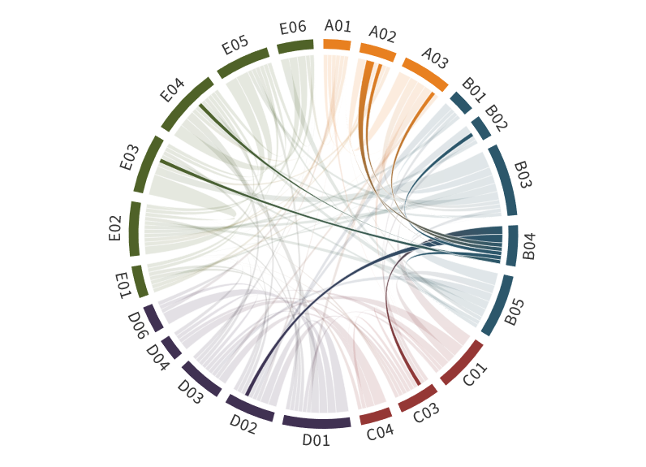

---
authors:
  - Andreas Herber
  - Manuela van Pinxteren
  - Mira Pöhlker, (former PIs:Hartmut Herrmann, Frank Stratmann)
title: B04
---
# Spatial distribution, sources, and cloud processing of aerosol particles

(b04)=

Aerosol particles in general, and in particular Cloud Condensation Nuclei (CCN), Ice Nucleating Particles (INP), and Black Carbon (BC) particles influence the formation, the phase state, and properties of Arctic clouds, and thereby the radiative budget of the Arctic. Therefore, they play an important, but not fully understood role in the Arctic amplification. During the project phases I and II, we carried out groundbased and aircraft CCN, INP, and BC measurements, quantified the spatial and temporal variability of particle concentrations and properties, shed light on the particles’ origins and sources, unraveled linkages between INP and marine polysaccharides, and started to investigate the ocean as a potential marine INP source. For better understanding of aerosol interaction with clouds in the atmospheric boundary layer (ABL) not only the concentrations of the aerosol particles are important, also knowledge concerning particle fluxes at the bottom, the top and inside the marine boundary layer is needed, e.g., to distinguish between particles originating from local sources or long-range transport. This additional information can only be gained by simultaneous turbulence and aerosol measurements near the surface, and at the top of the ABL. This will be done in phase III with the newly developed airborne towed vehicle T-Bird together with the Polar 6 research aircraft, allowing for simultaneous aerosol and turbulence measurements at so-far unexplored low altitudes (near surface, 10 – 15 m) up to the ABL height and above. T-Bird measurements will be supplemented by dedicated laboratory experiments, in course of which the transfer and enrichment of INP and marine polysaccharides as INP tracers from the ocean to the atmosphere are studied.

## Hypothesis:

**Turbulent up and downward transport together with ocean-atmosphere transfer and long-range transport play key roles for the distribution and properties of aerosol particles as well as aerosol-cloud interactions in the atmospheric boundary layer over the marginal sea ice zone.**

We want to address the following scientific questions:

- What are the concentrations and properties of Arctic aerosol particles, especially CCN, INP, and BC, inside and outside the ABL, and do they show a long-term trend?
- Does a connection exist between heat and/or energy fluxes and aerosol particle fluxes inside and outside the ABL?
- Can the sea-to-air enrichment of INP/INP-tracers explain ambient Arctic INP concentrations?

Both, mixing at the bottom and top of the boundary layer and ocean to atmosphere aerosol particle transfer processes, are not well represented in atmospheric models. The project will help to elucidate their impacts on aerosol-cloud-interactions and resulting radiative effect. Our data will be prepared for implementation in atmospheric models and thereby help to better understand, how Arctic amplification will evolve in the future (SQ3).

## Achievements phase II

- A new parameterization ([Sze et al., 2022](https://doi.org/10.5194/acp-23-4741-2023)) concerning Arctic INP concentrations as function of season and temperature has been developed for use in atmospheric models (LES to global scale).
- Indications towards the marine origin of INP in the European Arctic have been found ([Hartmann et al., 2020](https://doi.org/10.1029/2020GL087770), [2021](https://doi.org/10.5194/acp-21-11613-2021)).
- Nine years of aircraft campaigns focusing on the differences between spring and summer, and on the vertical distribution of BC revealed a strong seasonal variability that is not only present at ground-level but also at higher altitudes. The BC mass concentration is a factor of 4 higher across the European and Canadian Arctic in spring, which is a consequence of the increased number of BC particles reaching the Arctic, the size of the BC particles remains constant in both seasons ([Donth et al., 2020](https://doi.org/10.5194/acp-20-8139-2020); [Ohata et al., 2021](https://doi.org/10.5194/acp-21-15861-2021); [Schacht et al., 2019](https://doi.org/10.5194/acp-19-11159-2019); [Jurányi et al., 2023](https://doi.org/10.1038/s43247-023-00749-x)).
- During [ACLOUD](../campaigns/acloud.md) in 2017, BC properties were derived from aerosol particles below and above clouds and from cloud residuals inside clouds. The presence of low-level clouds was associated with a radical change in the concentration and diameter of BC in the boundary layer compared to the free troposphere ([Zanatta et al., 2023](https://doi.org/10.5194/acp-23-7955-2023)).
- BC snow sample analysis indicated that a serious single particle soot photometer measurement artefact exists in the presence of sea-salt in the samples. Currently, a new method is being developed to overcome this problem for the [MOSAiC](../campaigns/mosaic.md) snow sample analysis.
- An optimized analytical method for the analysis of free and combined polysaccharides in saline samples was developed ([Zeppenfeld et al., 2020](https://doi.org/10.5194/os-16-817-2020)).
- Laboratory studies on Arctic microorganisms, including chemical and INP analyses, revealed that marine polysaccharides in the Arctic environment contain ice-active molecular groups, so that they act as INPs. These studies provide important findings on the previously unknown chemical composition of marine INP ([Wilson et al., 2015](https://doi.org/10.1038/nature14986)).
- Detailed measurements of polysaccharides in diverse compartments, supported by phytoplankton measurements ([C03](./01_project_c03.md)) show indications for bioprocessing and formation of polysaccharides on aerosol particles, which may affect the INP properties ([Zeppenfeld et al., 2020](https://doi.org/10.5194/os-16-817-2020), [2021](https://doi.org/10.1021/acsearthspacechem.0c00351); [van Pinxteren et al., 2022](https://doi.org/10.5194/acp-22-5725-2022); [Dall’Osto et al., 2022](https://doi.org/10.1016/j.scitotenv.2022.154772)).
- Chemical analysis and trajectories and sea ice maps (from [B05](./01_project_b05.md)) show a high enrichment of polysaccharides in aerosols when air is coming from Arctic Marginal Sea Ice Zone (MIZ). However, despite clear indications of the importance of MIZ as a source for marine INP and polysaccharides, their transfer to the atmosphere is still not understood.

## Achievements phase I

In B04, a strong variability, but no clear trend, of atmospheric Ice Nucleating Particles (INP) number concentrations over the past 500 years was discovered ([Hartmann et al., 2019](https://agupubs.onlinelibrary.wiley.com/doi/full/10.1029/2019GL082311)). However, a clear picture of INP seasonality in the Arctic with the highest concentrations in summer and lowest in winter was identified from recent measurements across the Arctic ([Wex et al., 2019](https://doi.org/10.5194/acp-19-5293-2019)). INP decrease from land to open sea, suggesting terrestrial contributions to the Arctic INP population ([Wendisch et al., 2019](https://journals.ametsoc.org/doi/10.1175/BAMS-D-18-0072.1)). The seasonal vertical distribution of Black Carbon (BC) properties controlled by transport patterns and emission sources was observed ([Schulz et al., 2019](https://www.atmos-chem-phys.net/19/2361/2019/acp-19-2361-2019.html)). Different sizes and concentrations relative to the cloud layer, with enhanced concentration above clouds were identified ([Wendisch et al., 2019](https://journals.ametsoc.org/doi/10.1175/BAMS-D-18-0072.1)). It was shown that the sea surface microlayer (SML) and samples from melt ponds contain ice active entities making them potential sources for atmospheric INP and marine sugars in the Arctic ([Zeppenfeld et al., 2019](https://doi.org/10.1021/acs.est.9b01469)). The free sugar glucose can act as an “easy to measure” INP tracer in Arctic seawater.

## Role within (AC)³

