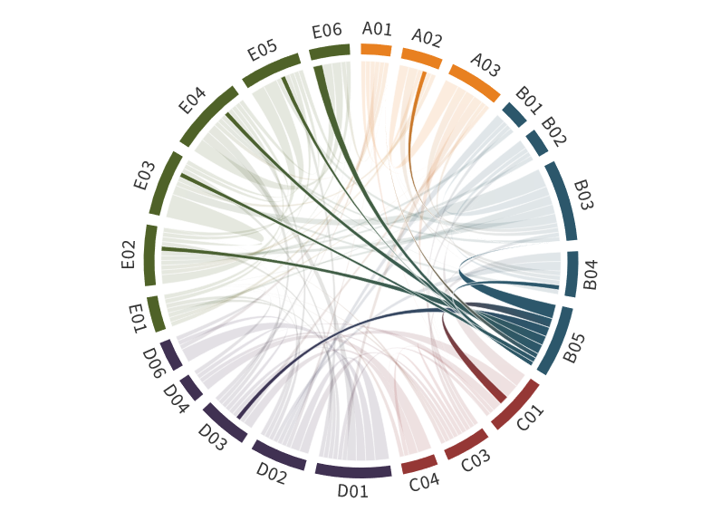

---
authors:
  - Kerstin Ebell
  - Gunnar Spreen (former PIs:Susanne Crewell, Annette Rinke, Georg Heygster)
title: B05
---
# Variability and trends of water vapor in the Arctic 

(b05)=

Water vapor (WV) is the strongest greenhouse gas and a key candidate for contributing to Arctic amplification. However, as shown in phases I and II of (AC)³, the lack of Arctic-wide reference WV observations together with the pronounced temporal and regional variability of WV hampers a firm assessment of the role of WV for Arctic amplification. When comparing different satellite WV products in the Arctic, systematic differences have been revealed, which particularly appear over different surface types (ocean, sea ice) and are partly related to the complex surface emissivity in the microwave (MW) spectral region. Thus, high-quality WV reference measurements for the Arctic are crucial for the evaluation of existing WV data sets to better understand the spatio-temporal characteristics of WV and its role in Arctic amplification. Within (AC)³, we intensified the observations of WV and surface characteristics in the central Arctic. We collected a comprehensive data set of MW remote sensing and in-situ WV, snow and sea ice measurements as part of the [MOSAiC](../campaigns/mosaic.md), [ATWAICE](https://blog.uni-koeln.de/awares/2022/08/26/polarstern-cruise-ps131-atwaice-walsema/) and [HALO–(AC)³](../campaigns/haloac3.md) campaigns. Improved retrievals for both satellite and ground-based MWR WV products have been developed. We will further exploit these unique WV data sets of the ship-based and airborne campaigns together with existing long-term and upcoming satellite and reanalysis data to assess the role of WV in Arctic amplification. We will analyze long-term trends in WV and evaluate their uncertainties, especially if the overall moistening trend found in reanalyses is reproduced by satellite data. The magnitude of the WV trend varies strongly between different reanalyses and will be constrained here by new satellite data. We will also characterize in detail WV during campaign periods with a focus on the strong temporal variability in WV, its vertical structure, and its impact on the atmospheric column properties and downward terrestrial radiation. New satellites will be exploited for more accurate and abundant WV observations, which will also benefit research beyond (AC)³.

## Hypothesis:

**Improved observations of spatio-temporal water vapor variability help to quantify the role of water vapor for Arctic amplification.**

Specifically we want to answer the following questions:

- Can we quantify the relevance of the WV feedback on Arctic amplification?
- Can we explain the strong differences between different WV products (reanalyses, satellites) using long-term and campaign-based reference measurements?
- How important is the vertical distribution of WV for the downward terrestrial radiation and the resulting impact on Arctic amplification?

As a greenhouse gas, WV impacts the downward terrestrial radiation (DTR) and thus surface temperature, i.e., a direct link to Arctic amplification (SQ1). The impact of WV and the WV profile on the DTR is thus a focus of B05. B05 will also look at the temporal variability of WV, in particular moisture intrusions from lower latitudes (SQ2) and the resulting effects on the atmospheric column. Long-term satellite and reanalysis data will be used to identify WV trends for the Arctic giving further insights into the future role of WV for Arctic amplification (SQ3).

# Achievements phase II

- New ground-based IWV MW retrieval exploiting higher (183 GHz) frequencies with an improved accuracy in low IWV conditions
- New satellite MW IWV retrieval that includes variable snow/ice surface emissivities
- Contributing to unique observational data records of WV in the central Arctic for the [MOSAiC](../campaigns/mosaic.md), [ATWAICE](https://blog.uni-koeln.de/awares/2022/08/26/polarstern-cruise-ps131-atwaice-walsema/) and [HALO–(AC)³](../campaigns/haloac3.md) campaigns
- Analysis of a WAI in April 2020 during MOSAiC (CCA4) and impact on sea ice concentration
- Evaluation of IWV from satellite products and reanalyses for [ACLOUD](../campaigns/acloud.md)/[PASCAL](../campaigns/pascal.md) campaign

## Achievements phase I

In B05, new retrieval techniques to derive the Integrated Water Vapour (IWV) from satellite have been developed allowing continuous measurements of IWV fields over the ocean and sea ice by merging observations from different microwave satellite sensors ([Scarlat et al., 2017](https://www.atmos-meas-tech.net/11/2067/2018/); [Triana Gómez et al., 2018](https://ieeexplore.ieee.org/document/8517863); [Triana Gómez et al., 2020](https://doi.org/10.5194/amt-13-3697-2020)). A quantification of the uncertainty of trends in total water vapour based on reanalysis was performed ([Rinke et al., 2019](https://doi.org/10.1175/JCLI-D-19-0092.1)). Simulations of microwave brightness temperature for polar lows were carried out. Furthermore, an evaluation of IWV from satellite products, reanalyses, and HIRHAM simulations was done for the [ACLOUD](../campaigns/acloud.md) campaign. Also, an investigation of the relationship between IWV and thermal-infrared downward radiation in reanalyses and models was performed for the period of 1979-2016.

## Role within (AC)³

