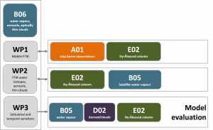

---
authors:
  - Justus Notholt
  - Roland Neuber
title: B06
---
# Latitudinal variability of water vapour, aerosols, and optically thin clouds 

(b06)=

The topic of this project was to investigate the spatial structure of the Arctic atmosphere during a ship cruise in the Fram strait and around Spitsbergen. We participated in the Polarstern cruises PS106 and PS107, where we operated the mobile FTIR facility MOFTIR. MOFTIR consisted of two FTIR instruments, ABS-FTIR operated in solar absorption geometry, EM-FTIR operated in emission
geometry. At the same time measurements with a similar suite of instruments were performed at the AWIPEV research base, Spitsbergen. The ship–borne observation are interpreted in close connection with the measurements obtained in Ny–Ålesund in the project [E02](./01_project_e02.md).

## Hypothesis:

**The latitudinal variability of water vapour, aerosols, and thin clouds from mid–latitudes to the high Arctic impacts on Arctic climate changes.**

In order to test the hypothesis, we will address and contribute to the following central questions exemplarily with the first ship cruise in phase I:

- How large is the latitudinal variability of aerosols, water vapour and thin clouds between the North Atlantic ice edge and the inner Arctic?
- How can the effect of the spatial atmospheric fine structure be parameterized using the time series obtained by the standard measurement stations and the satellite measurements?
- With the help of models, how does the spatial fine structure of the Arctic atmosphere affect the radiative budget of the Arctic atmosphere in summer?

## Achievements phase I

In B06, measurements to investigate the spatial structure of the Arctic atmosphere were collected during two ship expeditions and the ground-based, long-term [CONCORD](../campaigns/concord.md) observations at Ny-Ålesund. A retrieval scheme to derive cloud properties from thermal emission infrared spectrometer measurements, including detailed radiative transfer simulations, was developed and applied, which will be used in [E02](./01_project_e02.md).
Three papers report about the results in detail ([Barthlott et al., 2017](http://dx.doi.org/10.5194/essd-9-15-2017); [Kulla and Ritter, 2019](https://www.mdpi.com/2072-4292/11/6/616); [Ritter et al., 2018](https://www.tandfonline.com/doi/pdf/10.1080/16000889.2018.1539618)). The project prepared important input for [E02](./01_project_e02.md), however, it was found that the original objective of latitudinal variability is more appropriately characterised via long-term satellite data and, therefore, will be pursued in [B05](./01_project_b05.md). Project B06 will not be continued.

## Role within (AC)³

