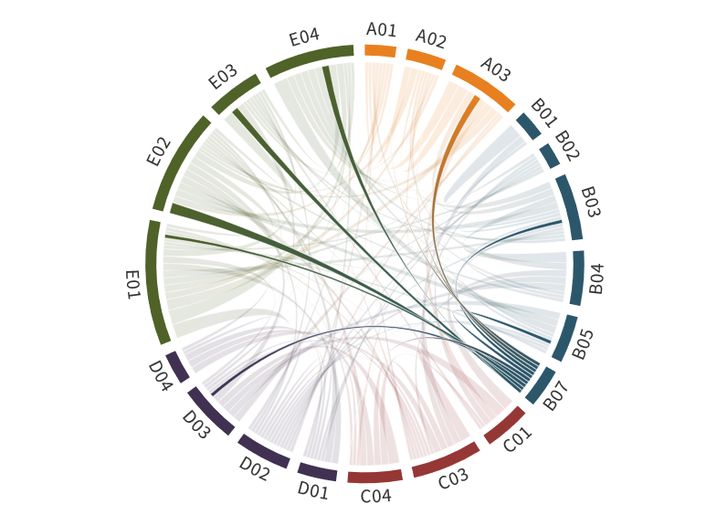

---
authors:
  - Heike Kalesse-Los
title: B07
---
# Influence of sea ice leads or polynyas on Arctic cloud properties 

(b07)=

As a new project in phase II, the focus was to investigate the characteristics of Arctic cloud properties influenced by sea ice conditions like leads or polynyas. This has been performed based on two cloud observational sites: the Atmospheric Radiation Measurement (ARM)-site at the North Slope of Alaska (NSA) in Utqiaǵvik, Alaska; and the [MOASiC](../campaigns/moasic.md) expedition. The first provided a long-term dataset of observations in the Western Arctic, whereas the [MOASiC](../campaigns/moasic.md) expedition gave an unprecedented opportunity for the detailed study of the central Arctic due to the extensive suite of ship-based and space-borne observations of clouds and sea ice, respectively.

Firstly, a fundamental task of the project was to develop the climatology of cloud properties and sea ice conditions. Cloud properties have been obtained by adapting the Cloudnet target classification ([Illingworth et al., 2007](https://doi.org/10.1175/BAMS-88-6-883)), under its new open-source version CloudnetPy developed by [Tukiainen et al. (2020a)](https://doi.org/10.21105/joss.02123), to be used with the ARM data. This was needed because CloudnetPy does not support ARM data by default. Cloudnet products for NSA have been created for the period from 2012 to 2022. One limitation of Cloudnet is that liquid cloud detection is constrained by the total lidar attenuation at the lowest liquid cloud layer. To partially mitigate this limitation two alternative Cloudnet datasets have been developed based on two different lidar systems: a ceilometer (prone to be more affected by attenuation) and the High Spectral Resolution Lidar (HSRL) with higher sensitivity to detect liquid at upper levels. The dataset for the HSRL, however, is only available for the period 2014 to 2019. Furthermore, NSA ARM data from four wintertime periods (2018-2022) has been specifically processed in order to train a convolution neural network for cloud liquid detection beyond lidar attenuation algorithm (VOODOO) developed by [Schimmel et al. (2022)](https://doi.org/10.5194/amt-15-5343-2022). Thus, the improvement of the Cloudnet cloud classification by VOODOO can be applied to the ARM instrumentation in general and to Arctic observatories like NSA and [MOASiC](../campaigns/moasic.md) in particular.

Secondly, the sea ice conditions around the observational sites have been linked to the cloud observations above the sites. To do that, the water vapor transport (WVT) being conveyed towards the observational site has been exploited as a mechanism to link sea ice condition upwind with the measured cloud properties above the site. This novel methodology is used to classify the observed cloud as coupled or decoupled to the WVT based on the relative location of the maximum vertical gradient of WVT height relative to the cloud mixing layer extending above and below the cloud top and base, respectively. Only a conical sub-sector of sea ice concentration (for NSA and [MOASiC](../campaigns/moasic.md)) or lead fraction (for [MOASiC](../campaigns/moasic.md)) centered at the observational site and extending up to 50 km radius and azimuth angle governed by the time dependent wind direction measured at the maximum WVT is related to the observed cloud.

## Hypothesis:

**Sea ice leads or polynyas increase the amount of Arctic boundary layer clouds, change their microphysical and radiative properties, and thus enhance Arctic amplification.**

Specifically, we want to study the questions:

- How is cloud cover changed in the presence of leads or polynyas (Q1)?
- How are macrophysical and microphysical cloud properties influenced by leads or polynyas (Q2)?
- Are there differences in Q1 and Q2 for different locations (Central Arctic vs Western Arctic)?

## Role within (AC)³

