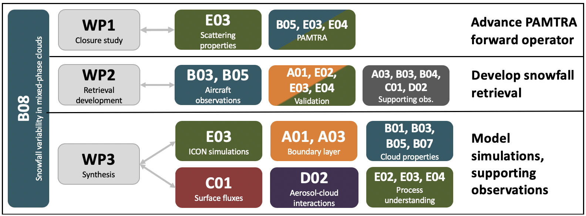

---
authors:
  - Maximilian Maahn
title: B08
---
# Characterising the spatial variability of ice water content in and below mixed-phase clouds

(b08)=

*Project ended in 2023*

B08 is a project that was funded later than the other (AC)³ phase II projects and started in July 2021. The goal of B08 was to investigate the spatial variability of ice water content (IWC) and the corresponding snowfall formation processes in mixed-phase clouds (MPCs) based on the (AC)³ airborne campaigns. The PL Maximilian Maahn and PhD student Nina Maherndl participated in the [HALO-(AC)³](../campaigns/haloac3.md) field experiment that took part in March and April 2022 and operated remote sensing instruments on board the research aircraft [Polar 5](../platforms/polar5.md). Maximilian Maahn acted as mission principle investigator (PI) for research flight 5 of [Polar 5](../platforms/polar5.md) on March 28. Within the B08 project, we were particularly interested in joint flights of [Polar 5](../platforms/polar5.md) and [Polar 6](../platforms/polar6.md) to obtain spatially and temporally collocated radar and in–situ measurements of clouds. This flight strategy was successfully implemented in five flights, collecting about four hours of collocated in cloud measurements. Further, B08 set up and operated together with [E02](./01_project_e02.md) a 2nd generation Video In Situ Snowfall Sensor (VISSS) in Ny–Ålesund. The main scientific results of phase II are presented below.

## Hypothesis:

**Spatial variability of ice water content (IWC) in and below MPCs is regulated by the spatial variability of surface properties and cloud top thermodynamic phase in addition to macrophysical properties such as cloud type, liquid water path, cloud depth, moisture availability and surface coupling. Correlating these properties to IWC variability will allow to identify the dominating processes.**

In testing the hypothesis, we address the following overarching questions:

- How can we combine in situ and remote sensing aircraft measurements to obtain spatial variability of IWC in and below clouds with minimal uncertainties?
- What determines the vertical and horizontal gradients of IWC in the Arctic atmosphere and how do these gradients differ depending on the observed dominant ice formation processes and boundary conditions such as surface fluxes, cloud phase variability at cloud top or liquid water path?
- How do the observed IWC gradients and ice mass fluxes differ from those present in the ICON-LEM model for similar cloud types and forcing?

## Role within (AC)³

