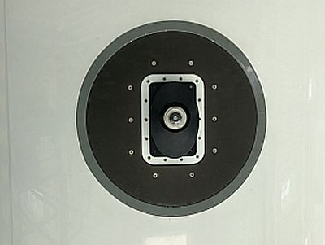

# HALO-(AC)³ 2022

[Campaign Wiki](https://home.uni-leipzig.de/~ehrlich/HALO_AC3_wiki_doku/doku.php?id=start)

## Description

## Publications

- Overview paper: [Wendisch et al., 2024: Overview: quasi-Lagrangian observations of Arctic air mass transformations – introduction and initial results of the HALO-(AC)³ aircraft campaign, Atmos. Chem. Phys., 24, 8865–8892](https://doi.org/10.5194/acp-24-8865-2024)
- Data overview paper: [Ehrlich et al., 2025: A comprehensive in situ and remote sensing data set collected during the HALO-(AC)³ aircraft campaign](https://doi.org/10.5194/essd-17-1295-2025)
- Synoptic overview paper: [Walbröl et al., 2024: Contrasting extremely warm and long-lasting cold air anomalies in the North Atlantic sector of the Arctic during the HALO-(AC)³ campaign](https://doi.org/10.5194/acp-24-8007-2024)

## Platforms

::::{grid} 3

:::{card}
:header: **HALO**
:link: /halo
:footer: Photo: DLR/Minikin

 
:::

:::{card}
:header: **Polar 5**
:link: /polar5

Image

:::

:::{card}
:header: **Polar 6**
:link: /polar6

Image

:::

::::

## Instruments

### HALO

:::{dropdown} BACARDI

Image

:::

:::{dropdown} BAHAMAS

Image

:::

:::{dropdown} Dropsondes

Image

:::

:::{dropdown} HAMP

Image

:::

:::::{dropdown} SMART

::::{grid} 2

:::{card}
:link: ../instruments/smart_halo.md

:::

:::{card} Description and data set
During HALO-(AC)³ SMART was configured with only one inlet with a hemispheric field of view, which was mounted on top of the fuselage to measure the spectral downward irradiance between 320nm and 2100nm wavelength.

https://doi.org/10.1594/PANGAEA.956151
:::

::::

@smart1

:::::

:::{dropdown} specMACS

Image

:::

:::{dropdown} VELOX

Image

:::

:::{dropdown} WALES

Image

:::

### P5

*Overview of Flights*

[HALO flight logs](https://home.uni-leipzig.de/~ehrlich/HALO_AC3_wiki_doku/doku.php?id=flight_logs_halo)

[Polar flight logs](https://home.uni-leipzig.de/~ehrlich/HALO_AC3_wiki_doku/doku.php?id=flight_logs)

*Involved Projects*

## Further Publications

[Special Issue in ACP: HALO-(AC)3 – an airborne campaign to study air mass transformations during warm-air intrusions and cold-air outbreaks (ACP/AMT inter-journal SI)](https://acp.copernicus.org/articles/special_issue1272.html) 
