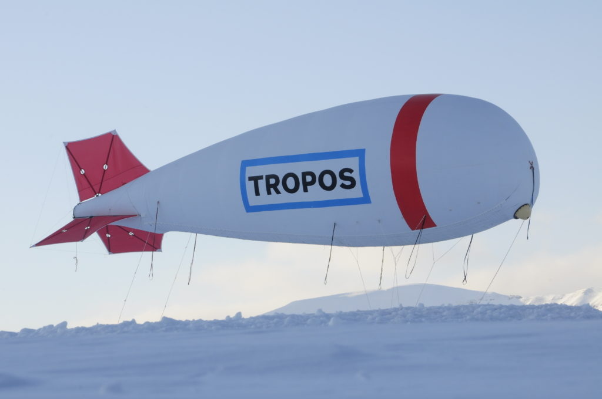
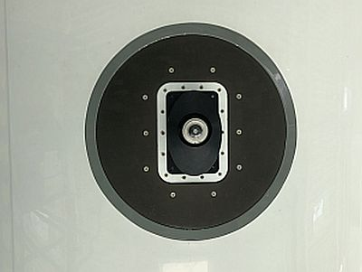

# PASCAL 2017

[Campaign Wiki]() (TBD)

[Media](https://www.tropos.de/aktuelles/messkampagnen/blogs-und-berichte/polarsternfahrt-ps106-2017/) (mostly German)

## Description

To investigate relevant small-scale processes in detail, an intensive field campaign was conducted during early summer in the central Arctic during the Physical feedbacks of Arctic planetary boundary layer, Sea ice, Cloud and AerosoL (PASCAL) drifting ice floe station. During PASCAL, an ice floe camp was built, while Polarstern was moored to the drifting ice floe. A multitude of physical, meteorological and biological research observations were conducted and is associated with the concurrent aircraft campaign ACLOUD.

The new BELUGA (Balloon-bornE moduLar Utility for profilinG the lower Atmosphere) tethered balloon system combines a set of instruments to measure turbulent and radiative parameters and energy fluxes and has proven its robust performance in cloudy conditions of the Arctic atmospheric boundary layer. 

## Publications

- Overview paper: 
- Synoptic overview paper: 

## Platforms

::::{grid} 2

:::{card}
:header: **RV Polarstern**
:link: /polarstern
:footer: Photo:

:::

:::{card}
:header: **BELUGA**
:link: /beluga
:footer: Photo: Holger Siebert, TROPOS

:::
::::

## Instruments

### RV Polarstern

:::::{dropdown} SMART

::::{grid} 2

:::{card}
:link: ../instruments/smart_halo.md
:footer: Photo: Johannes Röttenbacher (CC BY 4.0)

:::

:::{card} Description and data set
During HALO-(AC)³ SMART was configured with only one inlet with a hemispheric field of view, which was mounted on top of the fuselage to measure the spectral downward irradiance between 320nm and 2100nm wavelength.

https://doi.org/10.1594/PANGAEA.956151
:::

::::

@smart1

:::::

### BELUGA

:::::{dropdown}
:::: {grid} 2
:::{card}
:::
:::{card}
:::
::::
:::::

## Involved Projects 

## Notebooks

- @pascal-solar-irradiance

## Further Publications

[Arctic mixed-phase clouds as studied during the ACLOUD/PASCAL campaigns in the framework of (AC)3 (ACP/AMT/ESSD inter-journal Special Issue)](https://acp.copernicus.org/articles/special_issue971.html)

